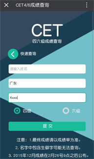
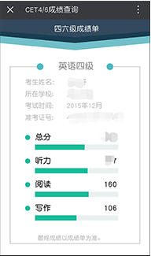

# 谢谢大家支持,不过项目在一年前练手写的....已经停止更新维护啦~
# 2017-8-3: 修改了99宿舍API中加解密的KEY,大概也许可以使用不过要记得会封ip的哟!加代理~
# Vue-Cet

>   基于Vuejs和Flask的免准考证四六级成绩查询

## Demo

关注微信公众号“sguwangyuan”——“工具栏”——“四六级”

## 说明

基于Vuejs进行开发，为了防止数据被爬取，成绩页使用Canvas绘制。

其中` cet` 文件夹为基于flask开发的api源码。

## Setup

``` bash
npm install
npm run dev
npm run build
```

## 图片预览：


  
